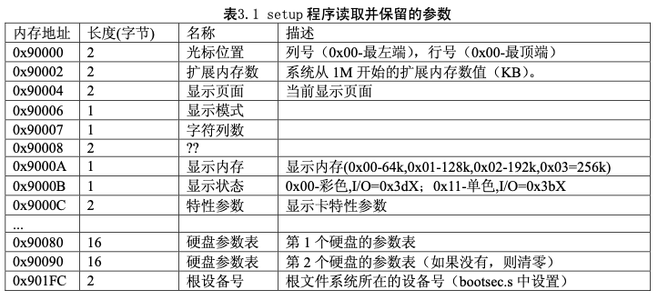
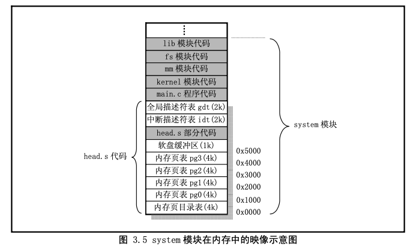

#1.操作系统对内存的使用


* 0x00000000 ~ 0x000fffff: 虽然在启动中会多次使用，但之后就变空。（1MB）

--------------------------------------------
* --0地址：BOIS程序用来实现各种功能的地方。
* --0x00000ff0: BOOTINFO
; BOOT_INFO相关
CYLS    EQU     0x0ff0          ; 引导扇区设置
LEDS    EQU     0x0ff1
VMODE   EQU     0x0ff2          ; 关于颜色的信息
SCRNX   EQU     0x0ff4          ; 分辨率X
SCRNY   EQU     0x0ff6          ; 分辨率Y
VRAM    EQU     0x0ff8          ; 图像缓冲区的起始地址
* --0x00007c00~~0x00007dff:启动区内容的装载地址。(IPL，IBM大叔规定的，MOV SP,0x7c00)//fake os装载地址。SP指向的地方。并不是代码段的地方？？？？
* --0x00008000:软盘磁盘内容拷贝到内存的地址。//拷贝的地址和真正的装载地址不是一回事。磁盘的第一个sector是启动区代码，BIOS直接转载到7c00.可能会拷贝到8000.
* --0x00008000 ~ 0x000081ff  启动区内容（启动区和装载器的区别？？？？？？？）
* --0x00008200 ~ 0x000083ff （IPL，启动程序装载器）
* --0x0000c200:操作系统地址(OS)//asmhead装载地址 ORG     0xc200
* --0x000a0000~~0x000affff:VRAM显卡内存地址（64KB）
* --0x000f0000地址：存放这BIOS程序本身

--------------------------------------------
* --0x00100000 ~ 0x00267fff: 用于保存软盘的内容（1440KB）
* --0x00268000 ~ 0x0026f7ff: 空（30KB）
* --0x0026f800 ~ 0x0026ffff: IDT（2KB）
* --0x00270000 ~ 0x0027ffff: GDT（64KB）
* --0x00280000 ~ 0x002fffff: bootpack.hrb（512KB）
* --0x00300000 ~ 0x003fffff: 栈及其它（1MB）
* --0x00400000 ~ NIL       ：空


0x7c00，是ipl的运行地址。
0x8000，是ipl代码内容的拷贝地址。
0xc200，真正操作系统代码的地址。运行地址？？这部分包括asmhead.nas + bootpack.c。

现在的程序从启动区开始，把磁盘上的内容装载到内存0x8000号地址，所以磁盘的0x4200处的内容，就是位于内存0x8000+0x4200 = 0xc200号地址。是真正操作系统的代码地址。
所以ORG的意思，就是将二进制代码段部署到某个内存地址。 


#2.大小端对齐，内存使用
> ESP		 -> c语言函数，默认ESP保存EBP
> 		 -> 
> 		 -> 
> 		 -> 
> esp+4   -> 0xff
> esp+5   -> 0xff
> esp+6   -> 0x00
> esp+7   -> 0x00
> esp+8   ->

一个int 4字节变量 var = 【esp+4】 = 0x0000ffff
注意存储顺序。
读数据从后往前读取。

栈的内存，从高到低放入数据，取数据从低到高。

函数的第一个参数是ESP+4
之前，C语言默认会将EBP保存到ESP

#3.asmhead.nas中内容拷贝
启动准备工作

```
BOTPAK  EQU     0x00280000      ; 加载bootpack
DSKCAC  EQU     0x00100000      ; 磁盘缓存的位置
DSKCAC0 EQU     0x00008000      ; 磁盘缓存的位置（实模式）

; bootpack传递

        MOV     ESI,bootpack    ; 转送源//bootpack.hrb（512KB）
        MOV     EDI,BOTPAK      ; 转送目标//0x00280000
        MOV     ECX,512*1024/4
        CALL    memcpy

; 磁盘数据最终转送到它本来的位置去
; 首先从启动扇区开始

        MOV     ESI,0x7c00      ; 转送源//启动区，IPL代码，512byte
        MOV     EDI,DSKCAC      ; 转送目标//0x00100000, 保存软盘的内容（1440KB）
        MOV     ECX,512/4
        CALL    memcpy

; 剩余的全部

        MOV     ESI,DSKCAC0+512 ; 转送源
        MOV     EDI,DSKCAC+512  ; 转送源目标
        MOV     ECX,0
        MOV     CL,BYTE [CYLS]
        IMUL    ECX,512*18*2/4  ; 从柱面数变换为字节数/4
        SUB     ECX,512/4       ; 减去 IPL 偏移量
        CALL    memcpy

; 必须由asmhead来完成的工作，至此全部完毕
; 以后就交由bootpack来完成

; bootpack启动
```

* memcpy(bootpack, BOTPAK, 512*1024/4)
	* 从bootpack的地址开始的512KB的内容复制到0x00280000号地址。
	* bootpack是asmhead.nas的最后一个标签。haribote.sys是通过asmhead.bin+bootpack.hrb连接起来而生成的。所以asmhead结束的地方，紧接着bootpack.hrb最前面的部分。 


* memcpy(0x7c00, DSKCAC, 512/4)
	* DSKCAC  = 0x00100000
	* 从0x7c00复制512字节到0x00100000。这个正好是启动扇区。

* memcpy(DSKCAC0+512, DSKCAC+512, cyls* 512 * 18 * 2 / 4 -  512/4);
	* 将0x00008200的磁盘内容，复制到0x00100200的地方。
	* 传送数据大小，按照柱面计算，需要减去启动区的512字节。

* 有个小问题：0x7c00和0x008200处的内容哪里来的？？？

#4.asmhead.nas中跳转bootpack.hrb

```
; 必须由asmhead来完成的工作，至此全部完毕
; 以后就交由bootpack来完成

; bootpack启动

        MOV     EBX,BOTPAK
        MOV     ECX,[EBX+16]
        ADD     ECX,3           ; ECX += 3;
        SHR     ECX,2           ; ECX /= 4;
        JZ      skip            ; 没有要转送的东西时
        MOV     ESI,[EBX+20]    ; 转送源
        ADD     ESI,EBX
        MOV     EDI,[EBX+12]    ; 转送目标
        CALL    memcpy
skip:
        MOV     ESP,[EBX+12]    ; 堆栈的初始化
        JMP     DWORD 2*8:0x0000001b
```

* [EBX+12]：0x00310000//栈及其它（1MB）
* [EBX+16]： 0x11a8//length
* [EBX+20]：0x10c8//start 

* 它会将bootpack.hrb 第0x10c8字节开始的0x11a8字节的内容，拷贝到0x00310000。大家可能不明白为什么要做这种处理？但这个问题必须要等到“纸娃娃系统”的应用程序讲完之后才能讲清楚。
* 最后将0x00310000带入到ESP里，然后用一个特别的JMP指令，将2*8代入到CS里，同时移动到0x1b号地址。这里的0x1b地址，是指第二段的0x1b地址。第二个段的基地址是0x00280000，所以实际上是从0x0028001b开始执行的。这也就是bootpack.hrb的0x1b地址。这样就开始执行bootpack.hrb了。


#5.linux0.11-overall

这里先总的说明一下 Linux 操作系统启动部分的主要执行流程。当 PC 的电源打开后，80x86 结构的 CPU 将自动进入实模式，并从地址 0xFFFF0 开始自动执行程序代码，这个地址通常是 ROM-BIOS 中的地 址。PC 机的 BIOS 将执行某些系统的检测，并在物理地址 0 处开始初始化中断向量。此后，它将可启动设 备的第一个扇区(磁盘引导扇区，512 字节)读入内存绝对地址 0x7C00 处，并跳转到这个地方。启动设 备通常是软驱或是硬盘。这里的叙述是非常简单的，但这已经足够理解内核初始化的工作过程了。

Linux 的最最前面部分是用 8086 汇编语言编写的(boot/bootsect.s)，它将由 BIOS 读入到内存绝对地址 0x7C00(31KB)处，当它被执行时就会把自己移到绝对地址 0x90000(576KB)处，并把启动设备中后 2kB 字 节代码(boot/setup.s)读入到内存 0x90200 处，而内核的其它部分(system 模块)则被读入到从地址 0x10000 开始处，因为当时system模块的长度不会超过0x80000字节大小(即512KB)，所以它不会覆盖在0x90000 处开始的 bootsect 和 setup 模块。随后将 system 模块移动到内存起始处，这样 system 模块中代码的地址也 即等于实际的物理地址。便于对内核代码和数据的操作。图 3.1 清晰地显示出 Linux 系统启动时这几个程 序或模块在内存中的动态位置。其中，每一竖条框代表某一时刻内存中各程序的映像位置图。在系统加载 期间将显示信息"Loading..."。然后控制权将传递给 boot/setup.s 中的代码，这是另一个实模式汇编语言程序。


启动部分识别主机的某些特性以及 vga 卡的类型。如果需要，它会要求用户为控制台选择显示模式。 然后将整个系统从地址 0x10000 移至 0x0000 处，进入保护模式并跳转至系统的余下部分(在 0x0000 处)。 此时所有32位运行方式的设置启动被完成: IDT、GDT以及LDT被加载，处理器和协处理器也已确认， 分页工作也设置好了;最终调用 init/main.c 中的 main()程序。上述操作的源代码是在 boot/head.S 中的，这 可能是整个内核中最有诀窍的代码了。注意如果在前述任何一步中出了错，计算机就会死锁。在操作系统 还没有完全运转之前是处理不了出错的。


#6.linux0.11-setup.s

##setup主流程
1.setup程序的作用主要是利用ROM BIOS中断读取机器系统数据，并将这些数据保存到0x90000开始
的位置(覆盖掉了 bootsect 程序所在的地方)，所取得的参数和保留的内存位置见下表 3.1 所示。这些参数将被内核中相关程序使用，例如字符设备驱动程序集中的 ttyio.c 程序等。



2.然后setup程序将system模块从0x10000-0x8fff(f 当时认为内核系统模块system的长度不会超过此值: 512KB)整块向下移动到内存绝对地址 0x00000 处。

3.接下来加载中断描述符表寄存器(idtr)和全局描述符表 寄存器(gdtr)，开启 A20 地址线，重新设置两个中断控制芯片 8259A，将硬件中断号重新设置为 0x20 - 0x2f。 

4.最后设置 CPU 的控制寄存器 CR0(也称机器状态字)，从而进入 32 位保护模式运行，并跳转到位于 system 模块最前面部分的 head.s 程序继续运行。

为了能让 head.s 在 32 位保护模式下运行，在本程序中临时设置了中断描述符表(idt)和全局描述符 表(gdt)，并在 gdt 中设置了当前内核代码段的描述符和数据段的描述符。在下面的 head.s 程序中会根据 内核的需要重新设置这些描述符表。

##当前内存镜像

在 setup.s 程序执行结束后，系统模块 system 被移动到物理地址 0x0000 开始处，而从 0x90000 处则存
放了内核将会使用的一些系统基本参数，示意图(图 3.2)如下。


此时临时全局表中有三个描述符，第一个是(NULL)不用，另外两个分别是代码段描述符和数据段描述 符。它们都指向系统模块的起始处，也即物理地址 0x0000 处。这样当 setup.s 中执行最后一条指令 'jmp 0,8 '(第193行)时，就会跳到head.s程序开始处继续执行下去。这条指令中的'8'是段选择符，用来指定 所需使用的描述符项，此处是指 gdt 中的代码段描述符。'0'是描述符项指定的代码段中的偏移值。

#7.linux0.11--head.s

## 功能描述
head.s 程序在被编译后，会被连接成 system 模块的最前面开始部分，这也就是为什么称其为头部(head)
程序的原因。从这里开始，内核完全都是在保护模式下运行了。heads.s 汇编程序与前面的语法格式不同， 它采用的是 AT&T 的汇编语言格式，并且需要使用 GNU 的 gas 和 gld2进行编译连接。因此请注意代码中 赋值的方向是从左到右。

```
这段程序实际上处于内存绝对地址 0 处开始的地方。这个程序的功能比较单一。
1.首先是加载各个数据 段寄存器，重新设置中断描述符表 idt，共 256 项，并使各个表项均指向一个只报错误的哑中断程序。
2.然后 重新设置全局描述符表 gdt。
3.接着使用物理地址 0 与 1M 开始处的内容相比较的方法，检测 A20 地址线是 否已真的开启(如果没有开启，则在访问高于1Mb物理内存地址时CPU实际只会访问(IP MOD 1Mb) 地址处的内容)，如果检测下来发现没有开启，则进入死循环。
4.然后程序测试 PC 机是否含有数学协处理器 芯片(80287、80387 或其兼容芯片)，并在控制寄存器 CR0 中设置相应的标志位。
5.接着设置管理内存的分 页处理机制，将页目录表放在绝对物理地址 0 开始处(也是本程序所处的物理内存位置，因此这段程序将 被覆盖掉)，紧随后面放置共可寻址 16MB 内存的 4 个页表，并分别设置它们的表项。
6.最后利用返回指令 将预先放置在堆栈中的/init/main.c 程序的入口地址弹出，去运行 main()程序。
```

## head.s 程序执行结束后的内存映像
head.s 程序执行结束后，已经正式完成了内存页目录和页表的设置，并重新设置了内核实际使用的中 断描述符表 idt 和全局描述符表 gdt。另外还为软盘驱动程序开辟了 1KB 字节的缓冲区。此时 system 模块 在内存中的详细映像见图 3.5 所示。




#8.内存分页

```
;/*
; * Linus 将内核的内存页表直接放在页目录之后，使用了4 个表来寻址16 Mb 的物理内存。
; * 如果你有多于16 Mb 的内存，就需要在这里进行扩充修改。
; */
;// 每个页表长为4 Kb 字节，而每个页表项需要4 个字节，因此一个页表共可以存放1000 个，
;// 表项如果一个表项寻址4 Kb 的地址空间，则一个页表就可以寻址4 Mb 的物理内存。页表项
;// 的格式为：项的前0-11 位存放一些标志，如是否在内存中(P 位0)、读写许可(R/W 位1)、
;// 普通用户还是超级用户使用(U/S 位2)、是否修改过(是否脏了)(D 位6)等；表项的位12-31
;// 是页框地址，用于指出一页内存的物理起始地址。
org 1000h       ;// 从偏移0x1000 处开始是第1 个页表（偏移0 开始处将存放页表目录）。
pg0:

org 2000h
pg1:

org 3000h
pg2:

org 4000h
pg3:

org 5000h       ;// 定义下面的内存数据块从偏移0x5000 处开始。

;/*
; * Setup_paging
; *
; * 这个子程序通过设置控制寄存器cr0 的标志（PG 位31）来启动对内存的分页处理
; * 功能，并设置各个页表项的内容，以恒等映射前16 MB 的物理内存。分页器假定
; * 不会产生非法的地址映射（也即在只有4Mb 的机器上设置出大于4Mb 的内存地址）。
; *
; * 注意！尽管所有的物理地址都应该由这个子程序进行恒等映射，但只有内核页面管
; * 理函数能直接使用>1Mb 的地址。所有“一般”函数仅使用低于1Mb 的地址空间，或
; * 者是使用局部数据空间，地址空间将被映射到其它一些地方去-- mm(内存管理程序)
; * 会管理这些事的。
; *
; * 对于那些有多于16Mb 内存的家伙- 太幸运了，我还没有，为什么你会有:-)。代码就
; * 在这里，对它进行修改吧。（实际上，这并不太困难的。通常只需修改一些常数等。
; * 我把它设置为16Mb，因为我的机器再怎么扩充甚至不能超过这个界限（当然，我的机
; * 器很便宜的:-)）。我已经通过设置某类标志来给出需要改动的地方（搜索“16Mb”），
; * 但我不能保证作这些改动就行了 :-( )
; */
align 2     ;// 按4 字节方式对齐内存地址边界。
setup_paging:   ;// 首先对5 页内存（1 页目录+ 4 页页表）清零
    mov ecx,1024*5      ;/* 5 pages - pg_dir+4 page tables */
    xor eax,eax
    xor edi,edi         ;/* pg_dir is at 0x000 */
                            ;// 页目录从0x000 地址开始。
    pushf       ;// VC内汇编使用cld和std后，需要自己恢复DF的值
    cld
    rep stosd
;// 下面4 句设置页目录中的项，我们共有4 个页表所以只需设置4 项。
;// 页目录项的结构与页表中项的结构一样，4 个字节为1 项。参见上面的说明。
;// "$pg0+7"表示：0x00001007，是页目录表中的第1 项。
;// 则第1 个页表所在的地址= 0x00001007 & 0xfffff000 = 0x1000；第1 个页表
;// 的属性标志= 0x00001007 & 0x00000fff = 0x07，表示该页存在、用户可读写。
    mov eax,_pg_dir
    mov [eax],pg0+7     ;/* set present bit/user r/w */
    mov [eax+4],pg1+7       ;/*  --------- " " --------- */
    mov [eax+8],pg2+7       ;/*  --------- " " --------- */
    mov [eax+12],pg3+7      ;/*  --------- " " --------- */
;// 下面6 行填写4 个页表中所有项的内容，共有：4(页表)*1024(项/页表)=4096 项(0 - 0xfff)，
;// 也即能映射物理内存4096*4Kb = 16Mb。
;// 每项的内容是：当前项所映射的物理内存地址+ 该页的标志（这里均为7）。
;// 使用的方法是从最后一个页表的最后一项开始按倒退顺序填写。一个页表的最后一项
;// 在页表中的位置是1023*4 = 4092。因此最后一页的最后一项的位置就是$pg3+4092。
    mov edi,pg3+4092        ;// edi -> 最后一页的最后一项。
    mov eax,00fff007h       ;/*  16Mb - 4096 + 7 (r/w user,p) */
                            ;// 最后1 项对应物理内存页面的地址是0xfff000，
                            ;// 加上属性标志7，即为0xfff007.
    std                 ;// 方向位置位，edi 值递减(4 字节)。
L3: stosd               ;/* fill pages backwards - more efficient :-) */
    sub eax,00001000h   ;// 每填写好一项，物理地址值减0x1000。
    jge L3              ;// 如果小于0 则说明全添写好了。
    popf
;// 设置页目录基址寄存器cr3 的值，指向页目录表。
    xor eax,eax     ;/* 页目录表(pg_dir)在0x0000 处。 */
    mov cr3,eax     ;/* cr3 - page directory start */
;// 设置启动使用分页处理（cr0 的PG 标志，位31）
    mov eax,cr0
    or  eax,80000000h   ;// 添上PG 标志。
    mov cr0,eax         ;/* set paging (PG) bit */
    ret                     ;/* this also flushes prefetch-queue */
;// 在改变分页处理标志后要求使用转移指令刷新预取指令队列，这里用的是返回指令ret。
;// 该返回指令的另一个作用是将堆栈中的main 程序的地址弹出，并开始运行/init/main.c
;// 程序。本程序到此真正结束了。    
```


