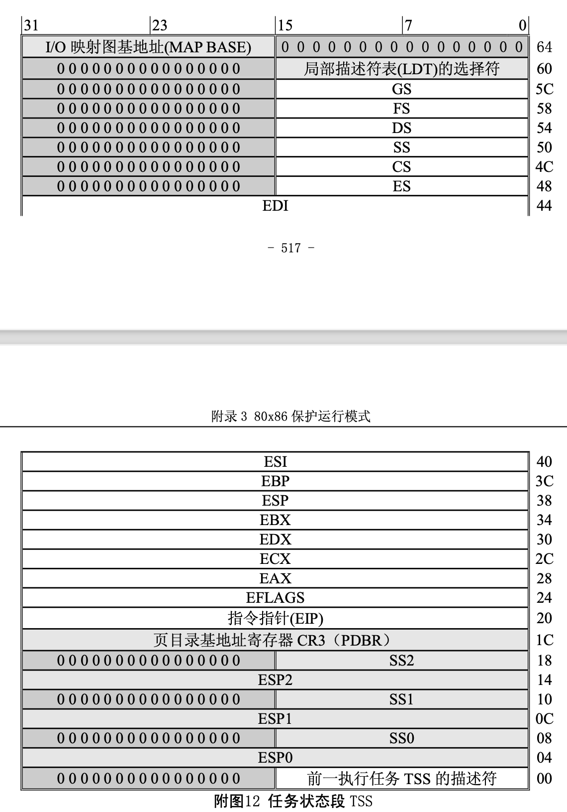
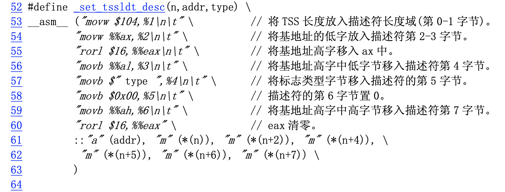

#1.任务切换一些背景（doll）
* 一般操作系统每个切换间隔是0.01~0.03秒。切换动作本身需要消耗0.0001秒。
* 当你向CPU发出任务切换的指令时，CPU会先把寄存器中的值全部写入内存，这样做是为了当以后切换回这个程序的时候，可以从中断的地方继续运行。
* 接下来，为了运行下一个程序，CPU会把所有的寄存器的值从内存中读出来，这样就完成了一次切换。

#2.TSS(doll)
任务状态段，Task Status Segment

```cpp
struct TSS32 {
    int backlink, esp0, ss0, esp1, ss1, esp2, ss2, cr3;         //任务设置相关信息
    int eip, eflags, eax, ecx, edx, ebx, esp, ebp, esi, edi;    //32位寄存器
    int es, cs, ss, ds, fs, gs;                                 //16位寄存器
    int ldtr, iomap;                                            //任务设置相关
};
```
* 第一行：任务设置相关信息，在执行任务切换的时候这些成员不会被写入。

* 第二行： 32位寄存器

* 第三行：16位寄存器

* 第四行：任务设置相关。ldtr = 0，iomap = 0x400000000
* 
#3.多任务（Multitasking）

为了提供有效的、受保护的多任务机制，80x86 使用了一些特殊的数据结构。支持多任务运行的寄存器和数据结构主要有任务状态段(Task State Segment)和任务寄存器(Task register)。使用这些数据结构， CPU 可以快速地从一个任务的执行切换到另一个任务，并保存原有任务的内容。

##3.1 任务状态段(Task State Segment – TSS)

处理器管理一个任务的所有信息存储在一个特殊类型的段中，即任务状态段 TSS。下图给出了 TSS 的 格式。其中的字段可分为两类:

•  处理器只读其中信息的静态字段集(图中灰色部分); 

•  每次任务切换时处理器将会更新的动态字段集。


任务状态段 TSS 可以处于线性空间的任何位置。TSS 与其它段一样，也是使用段描述符来定义的。访 问 TSS 的描述符会导致任务切换。因此，在大多数系统中都将描述符的 DPL(描述符特权级)字段设置为 最高特权级 0，这样就可以只允许可信任的软件执行任务的切换。TSS 的描述符只能放在全局描述符表 GDT 中。

##3.2 任务寄存器
任务寄存器(Task Register – TR)的作用与一般段寄存器的类似，它通过指向 TSS 来确定当前执行的 任务。它也有 16 位的可见部分和不可见部分。可见部分中的选择符用于在 GDT 表中选择一个 TSS 描述符， 处理器使用不可见部分来存放描述符中的基地址和段限长值。指令 LTR 和 STR 用于修改和读取任务寄存 器中的可见部分，指令所使用的操作数是一 16 位的选择符。

另外，还有一种提供对 TSS 间接、受保护引用的任务门描述符(Task Gete Descriptor)。这种描述符是 在一般段描述符格式的基地址位 15..0 字段(第 3、4 字节)中存放的是一个 TSS 描述符的选择符，并利用其 中的特权级字段(DPL)来控制使用描述符执行任务切换的权限。见下面有关中断描述符表 IDT 描述符中的 说明。


在以下 4 种情况下，CPU 会切换执行的任务:

* 1. 当前任务执行了一条引用 TSS 描述符的 JMP 或 CALL 指令;
* 2. 当前任务执行了一条引用任务门的 JMP 或 CALL 指令;
* 3. 引用了中断描述符表(IDT)中任务门的中断或异常;
* 4. 当嵌套任务标志 NT 置位时，当前任务执行了一个 IRET 指令。


#4.TSS描述符格式
见函数_set_tssldt_desc()

```cpp
//// 在全局表中设置任务状态段/局部表描述符。
// 参数:n - 在全局表中描述符项 n 所对应的地址;
// addr - 状态段/局部表所在内存的基地址。 
// type - 描述符中的标志类型字节。
//%0 - eax(地址 addr);%1 - (描述符项 n 的地址);%2 - (描述符项 n 的地址偏移 2 处);
//%3 - (描述符项n的地址偏移4处);%4 - (描述符项n的地址偏移5处)
//%5 - (描述符项n的地址偏移6处);%6 - (描述符项n的地址偏移7处)
```




#5.TSS内容
CPU 管理任务需要的所有信息被存储于一个特殊类型的段中，任务状态段(task state segment - TSS)。 图中显示出执行 80386 任务的 TSS 格式。

TSS 中的字段可以分为两类:

1. CPU 在进行任务切换时更新的动态信息集。这些字段有:

* o 通用寄存器(EAX，ECX，EDX，EBX，ESP，EBP，ESI，EDI); 
* o 段寄存器(ES, CS, SS, DS, FS, GS);
* o 标志寄存器(EIP);
* o 指令指针(EIP);

前一个执行任务的 TSS 的选择符(仅当返回时才更新)。

2. CPU 读取但不会更改的静态信息集。这些字段有: o 任务的 LDT 的选择符;

* o 含有任务页目录基地址的寄存器(PDBR);
* o 特权级 0-2 的堆栈指针;
* o 当任务进行切换时导致 CPU 产生一个调试(debug)异常的 T-比特位(调试跟踪位); 
* o I/O 比特位图基地址(其长度上限就是 TSS 的长度上限，在 TSS 描述符中说明)。

任务状态段可以存放在线形空间的任何地方。与其它各类段相似，任务状态段也是由描述符来定义 的。当前正在执行任务的 TSS 是由任务寄存器(TR)来指示的。指令 LTR 和 STR 用来修改和读取任务 寄存器中的选择符(任务寄存器的可见部分)。

I/O 比特位图中的每 1 比特对应 1 个 I/O 端口。比如端口 41 的比特位就是 I/O 位图基地址+5，位偏 移 1 处。在保护模式中，当遇到 1 个 I/O 指令时(IN, INS, OUT, OUTS)，CPU 首先就会检查当前特权级是 否小于标志寄存器的 IOPL，如果这个条件满足，就执行该 I/O 操作。如果不满足，那么 CPU 就会检查 TSS 中的 I/O 比特位图。如果相应比特位是置位的，就会产生一般保护性异常，否则就会执行该 I/O 操 作。


