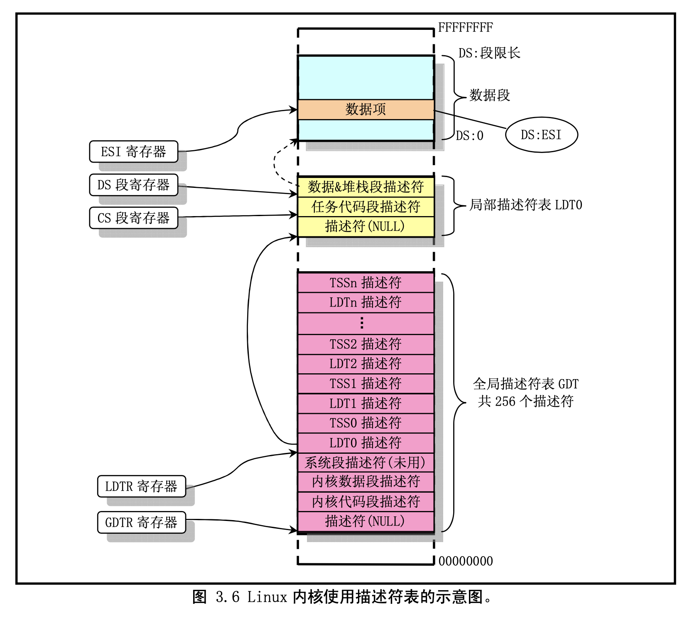

#1.GDT，分段

分段使用段寄存器。16位的时候，如果计算地址，只要将地址乘以16就可以了。
但现在是32位，如果写成“MOV AL,[DS:EBX]”，地址计算是DS+EBX，不再需要DS乘以16. 如果省略DS的地址，也会认为指定了DS，为0.

* 按照这种分段方法，为了表示一个段，需要以下信息。
--段的大小
--段的起始地址
--段的管理属性（禁止写入，禁止执行，系统专用等）
CPU用8个字节（64bit）来表示这些信息。但是用于指定段的寄存器只有16位。
段号可以用0~8191的数。因为段寄存器是16位，本来可以处理0~65535范围的数，但由于CPU设计上的原因，段寄存器的低三位不能使用。因此能够使用的部分只有13位，能够处理的就只有位于0~8191的段了。

所以管理这么多段的元数据就需要 8192*8 = 64KB。
CPU没那么大存储能力，不可能存储这么多数据，需要写入内存。这64KB的数据就成为GDT。

* GDT 是 global segment descriptor table的缩写，意思是全局段号记录表。将这些数据整齐地排列在内存的某个地方，然后将内存的起始地址和有效设定个数放在CPU内被称作GDTR的特殊寄存器中，设定就完成了。

--段起始地址：32位表示，low（2byte），mid（1byte），high（1byte）
--段上限：只能使用20位，原则上段上限最大指定1MB。所以这里有一个trick，在段的属性里设置了一个标志位，叫做Gbit。这个标志位是1的时候，limit的单位不解释成字节byte，而是解释成页page。
    这样一来，4K * 1MB = 4GB，所以可以指定4G的段。 limit_low(2byte), limit_high(0.5byte = 4bit)
--段属性：12bit，高4位放在limit_high的高4位里，ar有16bit。
    --高4位：扩展访问权。这四位在286时代没有，386才开始。这四位是由“GD00”构成，G是指刚才所说的Gbit，D是指段的模式，1是指32位模式，0是指16位模式。
    --低8位：
        --00000000（0x00）：未使用的记录表
        --10010010（0x92）：系统专用，可读写的段。不可执行。
        --10011010（0x9a）：系统专用，可执行的段。可读不可写。
        --11110010（0xf2）：应用程序用，可读写的段，不可执行。
        --11111010（0xfa）：应用程序用，可执行的段，可读不可写。
        CPU到底处于系统模式还是应用模式，取决于执行中的应用程序是位于访问权为0x9a的段，还是0xfa的段。

```
//linux0.11 setup.s

;//
;// lgdt 指令用于加载全局描述符表(gdt)寄存器，其操作数格式与lidt 指令的相同。全局描述符
;// 表中的每个描述符项(8 字节)描述了保护模式下数据和代码段（块）的信息。其中包括段的
;// 最大长度限制(16 位)、段的线性基址（32 位）、段的特权级、段是否在内存、读写许可以及
;// 其它一些保护模式运行的标志。参见后面205-216 行。
;//

    lidt fword ptr idt_48           ;// 加载中断描述符表(idt)寄存器，idt_48 是6 字节操作数的位置
                        ;// 前2 字节表示idt 表的限长，后4 字节表示idt 表所处的基地址。

    lgdt fword ptr gdt_48           ;// 加载全局描述符表(gdt)寄存器，gdt_48 是6 字节操作数的位置
;// 全局描述符表开始处。描述符表由多个8 字节长的描述符项组成。
;// 这里给出了3 个描述符项。第1 项无用，但须存在。第2 项是系统代码段
;// 描述符（208-211 行），第3 项是系统数据段描述符(213-216 行)。每个描述符的具体
;// 含义参见列表后说明。
gdt:
    dw  0,0,0,0     ;// 第1 个描述符，不用。
;// 这里在gdt 表中的偏移量为08，当加载代码段寄存器(段选择符)时，使用的是这个偏移值。
    dw  07FFh       ;// 8Mb - limit=2047 (2048*4096=8Mb)
    dw  0000h       ;// base address=0
    dw  9A00h       ;// code read/exec
    dw  00C0h       ;// granularity=4096, 386
;// 这里在gdt 表中的偏移量是10，当加载数据段寄存器(如ds 等)时，使用的是这个偏移值。
    dw  07FFh       ;// 8Mb - limit=2047 (2048*4096=8Mb)
    dw  0000h       ;// base address=0
    dw  9200h       ;// data read/write
    dw  00C0h       ;// granularity=4096, 386

idt_48:
    dw  0           ;// idt limit=0
    dw  0,0         ;// idt base=0L

gdt_48:
    dw  800h        ;// 全局表长度为2k 字节，因为每8 字节组成一个段描述符项
                        ;// 所以表中共可有256 项。
    dw  512+gdt,9h  ;// 4 个字节构成的内存线性地址：0009<<16 + 0200+gdt
                        ;// 也即90200 + gdt(即在本程序段中的偏移地址，205 行)。
```        
        
#2.段和GDT的关系
所有的段，都在GDT注册
每个段的大小不一定是64KB

#3 asmhead.nas中的临时GDT
```
        ALIGNB  16
GDT0:
        RESB    8               ; 初始值
        DW      0xffff,0x0000,0x9200,0x00cf ; 可以读写的段（segment）32bit
        DW      0xffff,0x0000,0x9a28,0x0047 ; 可执行的文件的32bit寄存器（bootpack用）

        DW      0
GDTR0:
        DW      8*3-1
        DD      GDT0

        ALIGNB  16
bootpack:
```

*  GDT0 也是一种特定的GDT。0号是空区域（null sector），不能够在哪里定义段。1号和2号分别由下式指定。我们用纸笔事先计算了一下，然后用DW排列出来，所以是写死的，临时的。

```cpp
set_segmdesc(gdt+1, 0xffffffff, 0x00000000, AR_DATA32_RW);
set_segmdesc(gdt+2, LIMIT_BOTPAK, ADR_BOTPAK, AR_CODE32_ER);
```

#4.任务切换一些背景
* 一般操作系统每个切换间隔是0.01~0.03秒。切换动作本身需要消耗0.0001秒。
* 当你向CPU发出任务切换的指令时，CPU会先把寄存器中的值全部写入内存，这样做是为了当以后切换回这个程序的时候，可以从中断的地方继续运行。
* 接下来，为了运行下一个程序，CPU会把所有的寄存器的值从内存中读出来，这样就完成了一次切换。

#5.TSS
任务状态段，Task Status Segment

```cpp
struct TSS32 {
    int backlink, esp0, ss0, esp1, ss1, esp2, ss2, cr3;         //任务设置相关信息
    int eip, eflags, eax, ecx, edx, ebx, esp, ebp, esi, edi;    //32位寄存器
    int es, cs, ss, ds, fs, gs;                                 //16位寄存器
    int ldtr, iomap;                                            //任务设置相关
};
```
* 第一行：任务设置相关信息，在执行任务切换的时候这些成员不会被写入。

* 第二行： 32位寄存器

* 第三行：16位寄存器

* 第四行：任务设置相关。ldtr = 0，iomap = 0x400000000

#6.GDT分段信息

* 操作系统代码段：2*8
* 操作系统数据段：1*8
* * TSS使用段：3*8 —— 1002 * 8
* 应用程序代码段：1003*8
	* task_a用（没有应用程序，不使用） 
* 应用程序代码段：1004 * 8
	* idle用（没有应用程序，不使用） 
* 1005：第一个命令行窗口的应用程序代码段
*  1006：第二个命令行窗口的应用程序代码段

应用程序代码段号 + 1000 =  应用程序数据段号

#7.LDT
GDT是global segment descriptor table的缩写。
LDT是local segment descriptor table的缩写。
GDT中的段设置是供所有任务通用的，而LDT中的段设置只对某个应用程序有效。
如果将应用程序段设置在LDT中，其它任务由于无法使用LDT，也就不用担心它们来搞破坏了。

和GDT一样，LDT的大小也是64KB（可容纳8192个段），不过在“纸娃娃系统中”我们现在只需要2个段，所以只使用了其中的16个字节，我们把这16个字节的内容放在struct TASK中。

我们可以通过GDRT这个寄存器将GDT的内存地址告知CPU，而LDT的内存地址则是通过在GDT中创建LDT段来告知CPU的。也就是说在GDT中，我们可以设置多个LDT（当然不能同时使用两个以上LLDT），这和TSS非常相似。

1.bootpack.h中添加用于设置LDT的段属性编号

```cpp
struct TASK {
    int sel, flags;     /* sel用来存放GDT的编号*/
    int level, priority; /* 优先级 */
    struct FIFO32 fifo;
    struct TSS32 tss;
    struct SEGMENT_DESCRIPTOR ldt[2];
    struct CONSOLE *cons;
    int ds_base, cons_stack;
};
```

2.mtask.c设置LDT。我们将LDT编号写入tss.ldtr，这样在创建TSS时候，顺便在GDT中设置了LDT，
CPU也就知道这个任务应该使用哪个LDT了。

```cpp
 74 struct TASK *task_init(struct MEMMAN *memman)
 75 {
...
...
 82     for (i = 0; i < MAX_TASKS; i++) {
 83         taskctl->tasks0[i].flags = 0;
 84         taskctl->tasks0[i].sel = (TASK_GDT0 + i) * 8;
 85         taskctl->tasks0[i].tss.ldtr = (TASK_GDT0 + MAX_TASKS + i) * 8;
 86         set_segmdesc(gdt + TASK_GDT0 + i, 103, (int) &taskctl->tasks0[i].tss, AR_TSS32);
 87         set_segmdesc(gdt + TASK_GDT0 + MAX_TASKS + i, 15, (int) taskctl->tasks0[i].ldt, AR_LDT);
 88     }
```

3.console.c，使得应用程序段创建在LDT中。

```cpp
333 int cmd_app(struct CONSOLE *cons, int *fat, char *cmdline)
334 {
...
...
365     if (finfo != 0) {
366         /*找到文件的情况*/
367         p = (char *) memman_alloc_4k(memman, finfo->size);
368         file_loadfile(finfo->clustno, finfo->size, p, fat, (char *) (ADR_DISKIMG + 0x003e00));
369         if (finfo->size >= 36 && strncmp(p + 4, "Hari", 4) == 0 && *p == 0x00) {
370             segsiz = *((int *) (p + 0x0000));
371             esp    = *((int *) (p + 0x000c));
372             datsiz = *((int *) (p + 0x0010));
373             dathrb = *((int *) (p + 0x0014));
374             q = (char *) memman_alloc_4k(memman, segsiz);
375             task->ds_base = (int) q;
376             set_segmdesc(task->ldt + 0, finfo->size - 1, (int) p, AR_CODE32_ER + 0x60);
377             set_segmdesc(task->ldt + 1, segsiz - 1, (int) q, AR_DATA32_RW + 0x60);
378             for (i = 0; i < datsiz; i++) {
379                 q[esp + i] = p[dathrb + i];
380             }
381             start_app(0x1b, 0 * 8 + 4, esp, 1 * 8 + 4, &(task->tss.esp0));
...
...
392         } else {
393             cons_putstr0(cons, ".hrb file format error.\n");
394         }
```

#8.linux0.11 LDT/GDT


```
针对不同的使用方面，描述符表分为三种:全局描述符表(GDT)、中断描述符表(IDT)和局部描述 符表(LDT)。
当 CPU 运行在保护模式下，某一时刻 GDT 和 IDT 分别只能有一个，分别由寄存器 GDTR 和 IDTR 指定它们的表基址。
局部表可以有 0-8191 个，其基址由当前 LDTR 寄存器的内容指定，是使用 GDT 中某个描述符来加载的，也即 LDT 也是由 GDT 中的描述符来指定。
但是在某一时刻同样也只有其中 的一个被认为是活动的。一般对于每个任务(进程)使用一个 LDT。在运行时，程序可以使用 GDT 中的 描述符以及当前任务的 LDT 中的描述符。

中断描述符表 IDT 的结构与 GDT 类似，在 Linux 内核中它正好位于 GDT 表的后面。
共􏰂有 256 项 8 字节的描述符。但每个描述符项的格式与 GDT 的不同，其中存放着相应中断过程的偏移值(0-1，6-7 字 节)、所处段的选择符值(2-3 字节)和一些标志(4-5 字节)。

下图 3.6 是 Linux 内核中所使用的描述符表在内存中的示意图。
图中，每个任务在 GDT 中占有两个描述符 项。GDT 表中的 LDT0 描述符项是第一个任务(进程)的局部描述符表的描述符，TSS0 是第一个任务的 任务状态段(TSS)的描述符。
每个 LDT 中􏰂有三个描述符，其中第一个不用，第二个是任务代码段的描 述符，第三个是任务数据段和堆栈段的描述符。
当 DS 段寄存器中是第一个任务的数据段选择符时，DS:ESI 即指向该任务数据段中的某个数据。
```

