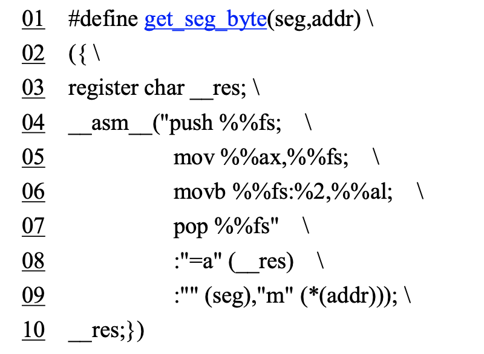

#1.嵌入式汇编的基本格式

```
􏰀节是第一次在内核源程序中接触到 C 语言中的嵌入式汇编代码。
由于我们在通常的 C 语言程序的 编制过程中一般是不会使用嵌入式汇编程序的，因此这里有必要对其基􏰀格式进行简单的描述，
详细的 说明可参见 GNU gcc 手册中[5]第 4 章的内容(Extensions to the C Language Family)，
或见参考文献[20] (Using Inline Assembly with gcc)。

具有输入和输出参数的嵌入汇编的基􏰀格式为:
asm(“汇编语句” 
: 输出寄存器 
: 输入寄存器
: 会被修改的寄存器 );

其中，“汇编语句”是你写汇编指令的地方;“输出寄存器”表示当这段嵌入汇编执行完之后，哪些 寄存器用于存放输出数据。
此地，这些寄存器会分别对应一 C 语言表达式或一个内存地址;“输入寄存 器”表示在开始执行汇编代码时，
这里指定的一些寄存器中应存放的输入值，它们也分别对应着一 C 变 量或常数值。下面我们用例子来说明嵌入汇编语句的使用方法。

我们在下面列出了前面代码中第 22 行开始的一段代码作为例子来详细解说，为了能看清楚我们将这 段代码进行了重新编排和编号。

```




```
这段 10 行代码定义了一个嵌入汇编语言宏函数。因为是宏语句，需要在一行上定义，因此这里使用反斜杠'\'将这些语句连成一行。
这条宏定义将被替换到宏名称在程序中被引用的地方。
第 1 行定义了宏 的名称，也即是宏函数名称get_seg_byte(seg,addr)。
第 3 行定义了一个寄存器变量__res。
第 4 行上的 __asm__表示嵌入汇编语句的开始。从第 4 行到第 7 行的 4 条 AT&T 格式的汇编语句。

第 8 行即是输出寄存器，这句的􏰂义是在这段代码运行结束后将 eax 所代表的寄存器的值放入__res 变量中，
作为􏰀函数的输出值，"=a"中的"a"称为加载代码，"="表示这是输出寄存器。

第 9 行表示在这段 代码开始运行时将 seg 放到 eax 寄存器中，""表示使用与上面同个位置的输出相同的寄存器。
而(*(addr)) 表示一个内存偏移地址值。
为了在上面汇编语句中使用该地址值，嵌入汇编程序规定把输出和输入寄存 器统一按顺序编号，
顺序是从输出寄存器序列从左到右从上到下以"%0"开始，分别记为%0、%1、...%9。
因此，输出寄存器的编号是%0(这里只有一个输出寄存器)，输入寄存器前一部分("" (seg))的编号是%1， 
而后部分的编号是%2。上面第 6 行上的%2 即代表(*(addr))这个内存偏移量。


现在我们来研究 4—7 行上的代码的作用。第一句将 fs 段寄存器的内容入栈;第二句将 eax 中的段 值赋给 fs 段寄存器;
第三句是把 fs:(*(addr))所指定的字节放入 al 寄存器中。
当执行完汇编语句后，输出 寄存器 eax 的值将被放入__res，作为该宏函数的返回值。很简单，不是吗?


通过上面分析，我们知道，宏名称中的 seg 代表一指定的内存段值，而 addr 表示一内存偏移地址量。 
到现在为止，我们应该很清楚这段程序的功能了吧!该宏函数的功能是从指定段和偏移值的内存地址处 取一个字节。
```


